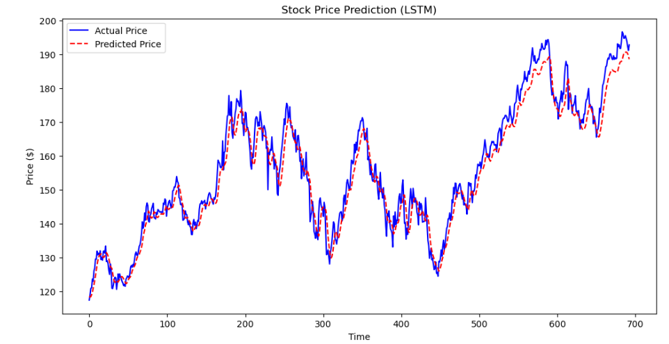
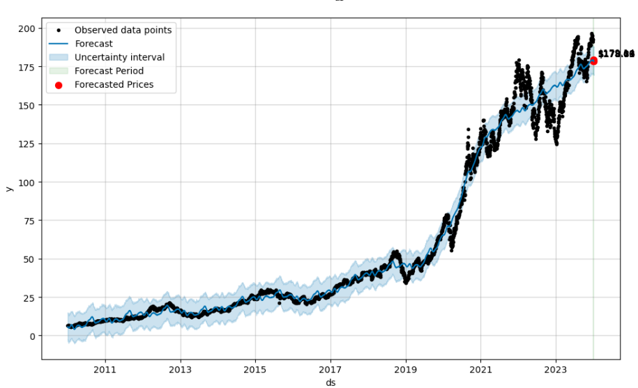

# Stock Price Prediction Project


## Built With


## Project Overview

This project is a comprehensive stock price prediction system using two distinct machine learning models: Long Short-Term Memory (LSTM) networks and Prophet. It downloads historical data for Apple (AAPL) from Yahoo Finance, performs exploratory data analysis, trains both models, evaluates their performance, and generates future forecasts.

## Features

- **Data Download & Cleaning**

  - Downloads AAPL stock data from Yahoo Finance using `yfinance`.
  - Handles potential formatting issues in the CSV file.
  - Converts and cleans the dataset for time-series analysis.

- **Exploratory Data Analysis (EDA)**

  - Visualizes historical closing prices.
  - Checks for missing values.

- **LSTM Model**

  - Preprocesses data into time-series windows.
  - Splits data into training and test sets.
  - Builds and trains an LSTM model using Keras.
  - Evaluates predictions with MAE and RMSE metrics.
  - Forecasts 7 days into the future.

- **Prophet Model**

  - Uses Facebook's Prophet to fit a time-series model.
  - Generates 7-day forecasts.
  - Visualizes forecasted prices along with uncertainty bounds.

- **Model Comparison**
  - Compares LSTM and Prophet forecasts visually.
  - Saves all results to CSV files for further analysis.

## 📈 LSTM Model Predictions

Below is the plot showing the actual vs predicted stock prices using the LSTM model:



---

## 🕰️ Prophet Model Forecast

Here is the forecast generated by the Prophet model for future stock prices:



## Requirements

Make sure the following packages are installed:

```bash
pip install yfinance pandas numpy matplotlib tensorflow scikit-learn prophet
```
